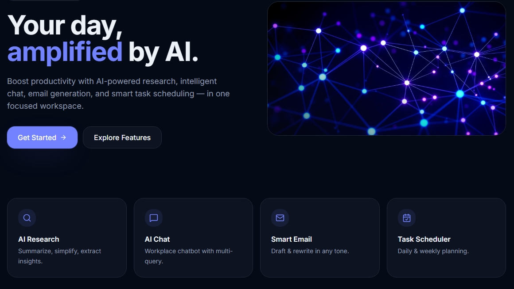
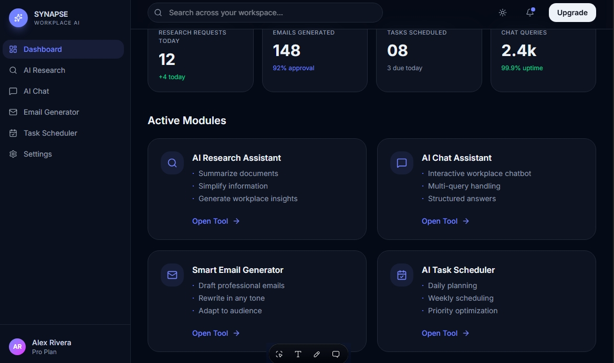
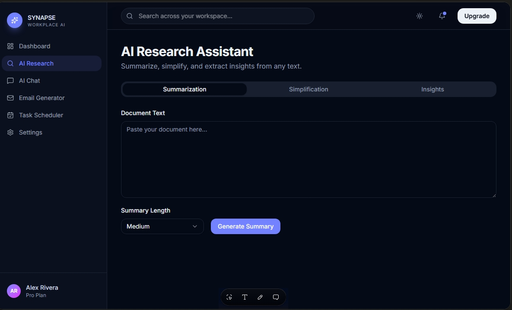
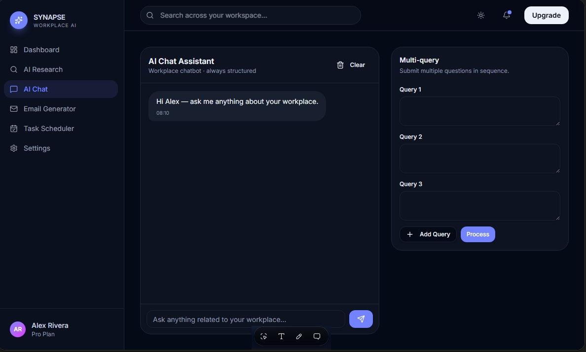
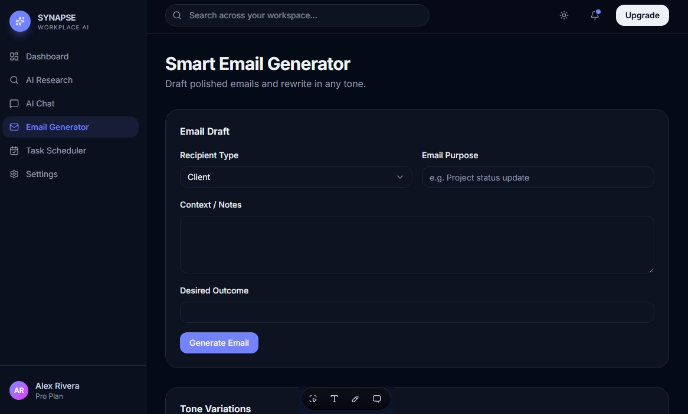
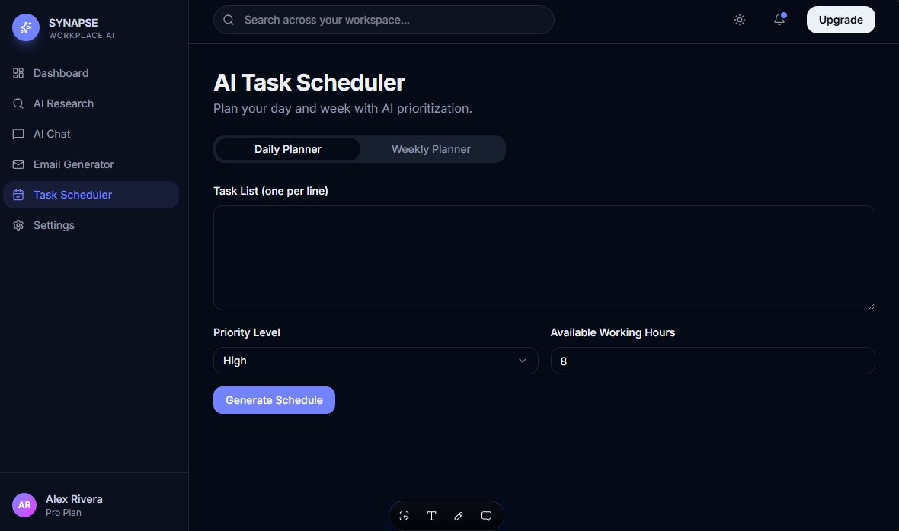
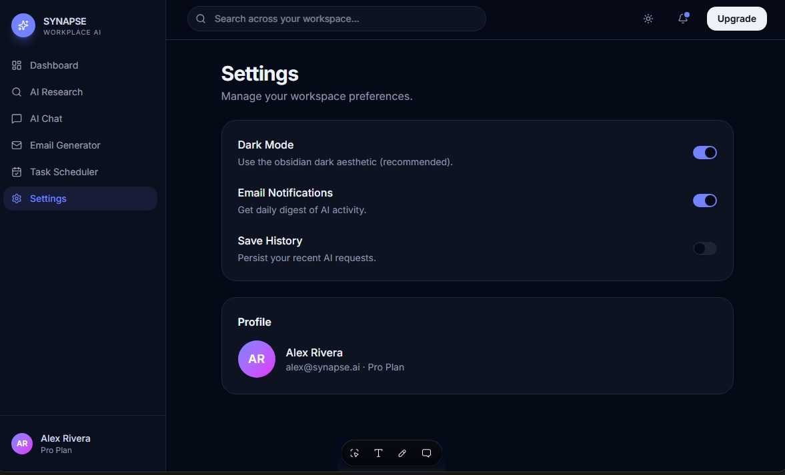

# AI-Powered Workplace Productivity Assistant 

Project Scope 

Objective: To design and develop an AI powered workplace assistant so that employees can improve productivity through automating repetitive tasks.  

Target Users: Office employees, Managers, and administrative staff. 

In Scope Feature List:  

* AI Research Assistant 

  Summarize articles, reports or topics 

  Provide key insights and recommendations 

  Simplify complex information for quick understanding 

* AI Chatbot Interface 

  Provide an interactive interface for user queries  

  Handle multiple prompts and responses 

  Simulate a real workplace assistant experience 

* Smart Email Generator 

  Generate context-based professional emails 

  Support tone variations (formal, informal, persuasive) 

  Adapt content based on audience (client, manager, team) 

* AI task scheduler 

  Generate structured daily or weekly plans 

  Prioritize tasks based on urgency and importance 

  Suggest time optimization strategies 

 

# Out of Scope Feature List: #

  Performing Complex Data Analysis 

  Complete replacement of Human Tasks 

  Processing sensitive Company data 

# Deliverables ad documentation: #

  Mock –up of AI powered workplace assistant 

  Development documentation 

  Training manuals for users 

# Timeline: 

   6 months for development and iteration and 9 months for rollout.  

# User Journey Map #

user persona: Mpho who is an Administrator gets caught up doing redundant tasks that decrease her productivity levels.
**Objective:** Mpho needs to help the operational Manager with a meeting she needs to have with team. 

Access: user opens AI Assistant chatpot interface.
Interacrtion: Mpho then prompts AI to assist with the necessary tasks needed to prepare for the meeting.
Assistance: The assistant the processes the request by routing question to the necessary feature to produce the desired output. 
Execution: Assistant then completes the action and confirms with the user.
Follow-up:Assistant offers proactive suggestions to steamline the users workflow and productivity. 

# AI Workplace Assistant (Synapse)

## Live Prototype

🚀 [Launch AI Workplace Assistant](https://workplace-assist.lovable.app)

## Project Overview

AI Workplace Assistant is an intelligent productivity tool built to help professionals work smarter by automating repetitive tasks, improving task management, and reducing administrative workload.

## Features

- AI Research Assistant
- AI Chat Assistant
- Smart Email Generator
- AI Task Scheduler

# AI Research Assistant #

Summarization Prompt
Summarize the following text into 3–5 bullet points. Highlight key insights, recommendations, and important data. Keep the tone professional and concise.

Simplification prompt 
Simplify the following complex information into plain language that can be understood quickly by a busy professional. Use short sentences and avoid jargon.

Insight prompt 
Based on the following text, provide actionable recommendations for workplace decision-making. Present them as a numbered list.

# AI Chat Interface #
Interactive Query Prompt
You are a workplace assistant. Answer user queries clearly and concisely. If the query is vague, ask one clarifying question before responding. Always provide structured outputs (bullet points, tables, or short paragraphs).

Multi-prompt Hnadling Prompt
Handle multiple user queries in sequence. For each query, provide a direct answer and, if relevant, suggest one follow-up action or resource.

# Smart Email Generator #
Email Draft Prompt
Draft a professional email based on the following context. Adapt tone based on audience (formal for managers/clients, friendly for team). Keep it concise, actionable, and polite. Include greeting and closing.

Tone Variation Prompt
Rewrite the following email in three tones: 
1. Formal (for clients/managers) 
2. Informal (for colleagues) 
3. Persuasive (for proposals). 
Present each version separately.

# AI Task Scheduler #
Daily Plan Prompt
Generate a structured daily plan based on the following tasks. Prioritize by urgency and importance. Suggest time optimization strategies. Present the plan in a clear table format.

Weekly Plan Prompt
Create a weekly schedule from the following tasks. Group tasks by category (meetings, deadlines, personal focus). Highlight urgent items in bold. Suggest one productivity tip for the week.

## Screenshots

# Application Screenshots

## Landing Page

The landing page introduces Synapse, an AI-powered workplace assistant designed to improve productivity through intelligent research, workplace communication, email generation, and task scheduling.

---

## Dashboard

The dashboard provides a centralized view of all workplace productivity tools and allows users to navigate seamlessly between application modules.

---

## AI Research Assistant

The AI Research Assistant enables users to summarize content, simplify complex information, and generate actionable workplace insights.

---

## AI Chat Assistant

The AI Chat Assistant provides a conversational interface where users can ask workplace-related questions and receive structured AI-generated responses.

---

## Smart Email Generator

The Smart Email Generator helps users create professional emails and generate different tone variations for workplace communication.

---

## AI Task Scheduler

The AI Task Scheduler assists users with organizing daily and weekly activities, prioritizing tasks, and improving time management.

## Settings Page

The Settings page allows users to customize their experience and manage application preferences.

---
# AI Prompt Structure #
# AI Research Assistant #

Summarization Prompt
Summarize the following text into 3–5 bullet points. Highlight key insights, recommendations, and important data. Keep the tone professional and concise.

Simplification prompt 
Simplify the following complex information into plain language that can be understood quickly by a busy professional. Use short sentences and avoid jargon.

Insight prompt 
Based on the following text, provide actionable recommendations for workplace decision-making. Present them as a numbered list.

# AI Chat Interface #
Interactive Query Prompt
You are a workplace assistant. Answer user queries clearly and concisely. If the query is vague, ask one clarifying question before responding. Always provide structured outputs (bullet points, tables, or short paragraphs).

Multi-prompt Hnadling Prompt
Handle multiple user queries in sequence. For each query, provide a direct answer and, if relevant, suggest one follow-up action or resource.

# Smart Email Generator #
Email Draft Prompt
Draft a professional email based on the following context. Adapt tone based on audience (formal for managers/clients, friendly for team). Keep it concise, actionable, and polite. Include greeting and closing.

Tone Variation Prompt
Rewrite the following email in three tones: 
1. Formal (for clients/managers) 
2. Informal (for colleagues) 
3. Persuasive (for proposals). 
Present each version separately.

# AI Task Scheduler #
Daily Plan Prompt
Generate a structured daily plan based on the following tasks. Prioritize by urgency and importance. Suggest time optimization strategies. Present the plan in a clear table format.

Weekly Plan Prompt
Create a weekly schedule from the following tasks. Group tasks by category (meetings, deadlines, personal focus). Highlight urgent items in bold. Suggest one productivity tip for the week.

